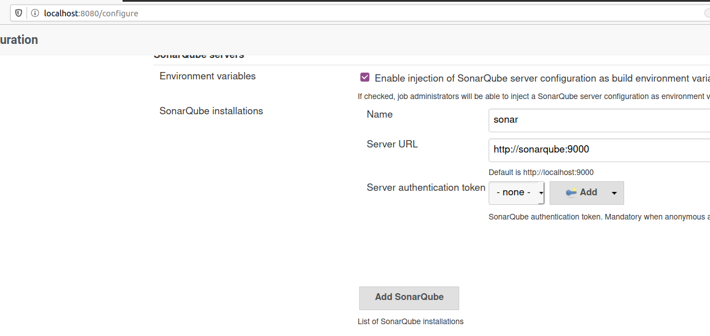
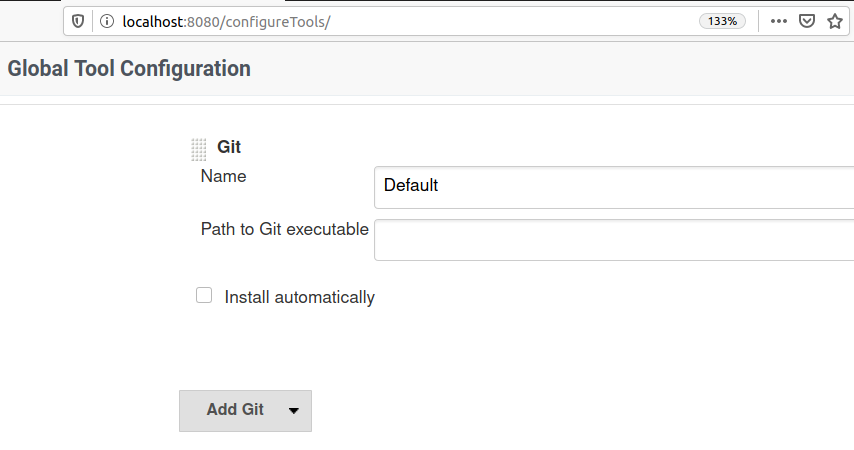
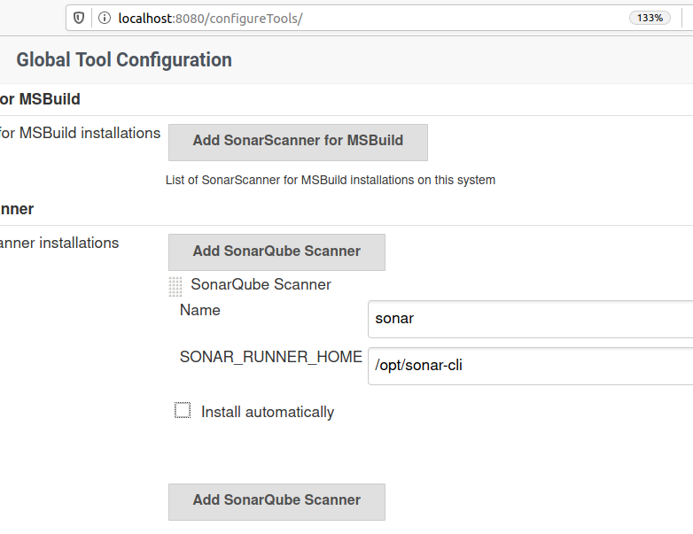
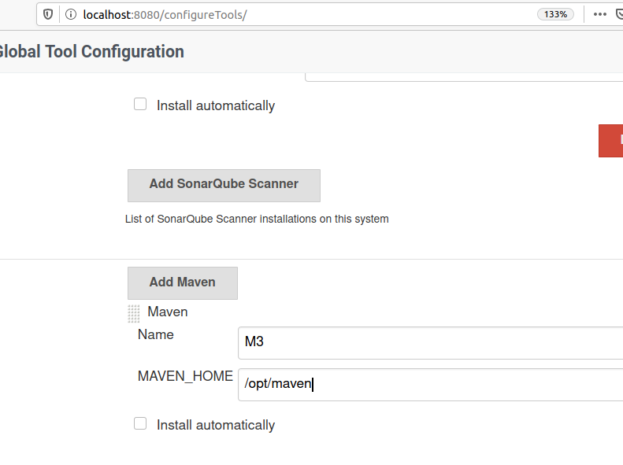
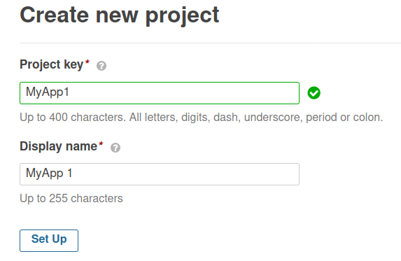
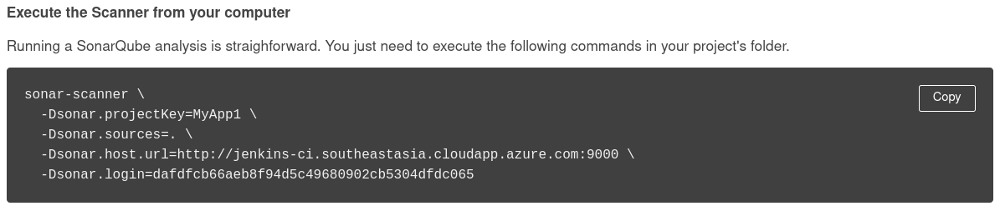
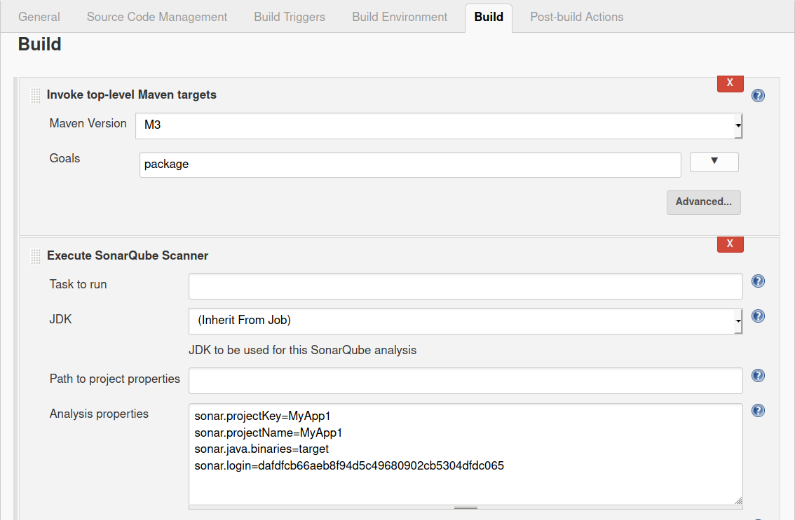
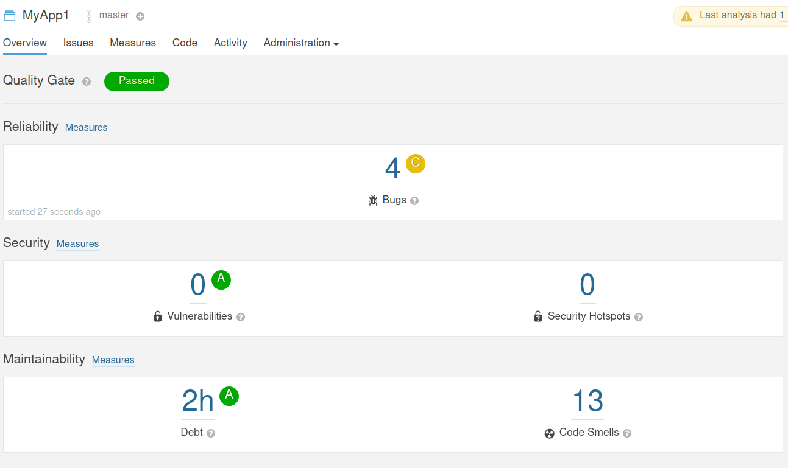

## Setting up your SonarQube server instance in docker

SonarQube is Code Quality Assessment tool, often used with DevOps tool-chains. It can be integrated with Jenkins-CI or Azure DevOps. It can perform quality check on multiple project types and languages.

This demo would focus on following environment:

1. Host machine configuration:

    ```yml
    OS:     Linux 64 Bit (Ubuntu 18.04 LTS )
    RAM:    16 GB
    Disk:   100 GB
    Softwares:
        docker-ce
        Git
        docker-compose
    ```
2. To Download all the required container images from my docker repositories, use following command:

    ```bash
    $ docker-compose pull
    ```

3.  Launch all three services: ci (jenkins), db (postgres) and sonarqube.

    ```bash
    ##Set max virtual memory count 
    $ sudo sysctl -w vm.max_map_count=262144
    ## Launch all services
    $ docker-compose up -d
    $ docker-compose ps
    ## OPTIONAL: View Individual Logs
    $ docker-compose logs ci
    $ docker-compose logs sonarqube
    $ docker-compose logs db
    ## OPTIONAL: Restart a Failed services (No effect on RUNNING services)
    $ docker-compose up -d
    ```

4.  Now, you can access services at following URLs:

    ```yml
    SonarQube: 
        url: http://localhost:9000 
        internalUrl: http://sonarqube:9000
        credentials:
            username: admin
            password: admin

    Jenkins-CI: 
        url: http://localhost:8080
        internalUrl: http://jenkins-ci:8080
        credentials: None
    
    ```

5.  Jenkins `Configure System` to set URL for SonarQube server (along with User credentials ).

    Visit http://localhost:8080/configure

    ```yml
    SonarQube-Server: http://sonarqube:9000
    Authentication: None
    ```
    

    > SonarQube is currently running as Docker service with hostname 'sonarqube'.

6.  Jenkins `Global Tool Configuration` to set HOME DIRECTORY of Sonar Scanner tool.

    Visit http://localhost:8080/configureTools/

    ```yaml
    Git:
        Path-to-Git:    ##KEEP EMPTY
    SonarQube-Scanner:
        Name:   sonar
        SONAR_RUNNER_HOME: /opt/sonar-cli
    Maven:
        Name: M3
        MAVEN_HOME: /opt/maven
    ```

    
    
    

## The Demo project on SonarQube server

1.  Visit sonarqube dashboard at `http://localhost:9000`, login with credentials (default: admin/admin).
2.  Create a new project.

    ```yaml
    Project-Key: MyApp1
    Display-Name: MyApp 1
    Token: 
        name: t1 
        Generate:
    Continue:
    Run-Analysis:
        Other:
            Linux:
    ```
    

3.  Copy the properties displayed by last command:

    


## The Demo Project on Jenkins

1. Open jenkins dashboard, no login required / prompted !
2. Create a new "Freestyle" Jenkins project with name "demo-1"
3. Configure demo-1 like this:
    
    Phase | Configuration | Comment 
    ------|---------------|---------
    Source Code Management | Git,<br/> Repository Url: https://github.com/mahendra-shinde/ci-servlet-demo  | You may use your own project repository instead of given one.
    Build Triggers | Choose Any | Choose any build trigger of your choice, or just skip.
    Build Environment | None | Choose option of your choice.
    Build | Build Step 1<br/> Invoke Top-Level Maven project, <br/> set Goal to `package` <br/><br/>    Build Step 2 <br/> Execute SonarQube Scanner, Use following analysis properties: <br/>  sonar.projectKey=MyApp1 <br/> sonar.projectName=MyApp 1 <br/> sonar.java.binaries=target <br/> sonar.login=dafdfcb66aeb8f94d5c49680902cb5304dfdc065| You must have a new project created using sonar dashboard. Copy the Project Name and Project Key generated on sonar dashboard.

    
    

4. Save the project and then use `Build Now` to trigger a test build. Once build is successful, try visiting sonar dashboard
    `http://localhost:9000/

    
    
